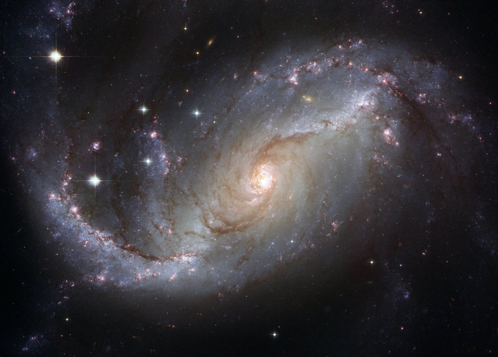

Space remains a mystery. We know that the Milky Way itself is between *100,000 and 150,000* light years across. The universe itself is another matter.

This site has been designed to provide a quick read to the latest scientific discoveries on our universe.

You can also read more about new discoveries in science by heading [to places](https://science.nasa.gov/).

